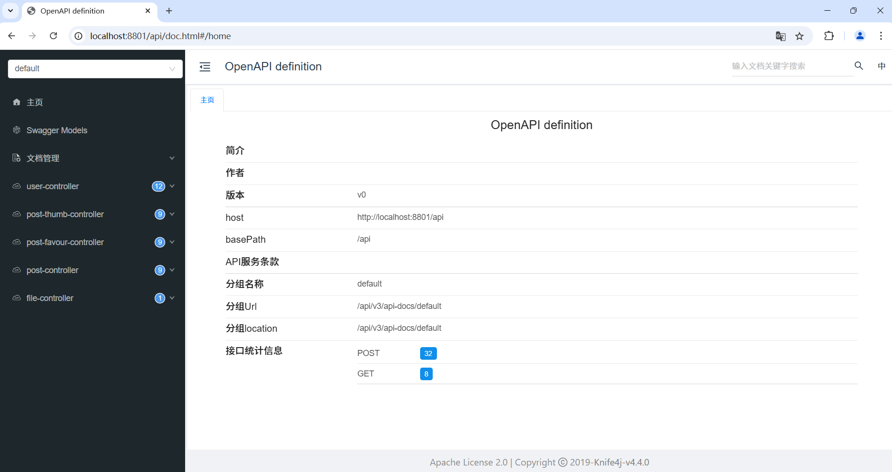
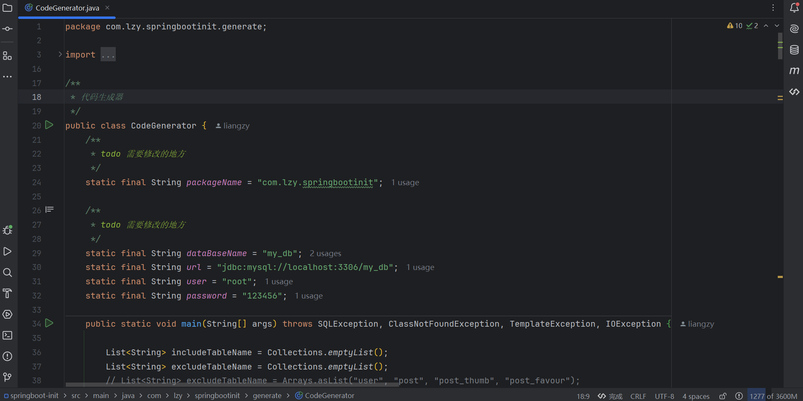

# SpringBoot 项目初始模板

基于 Java SpringBoot 的项目初始模板，整合了常用框架和主流业务的示例代码，支持业务代码生成器（自动生成 Service、Controller、数据模型代码）。

## 模板技术

### 主流框架 & 特性

- Spring Boot 2.7.2
- Spring MVC
- MyBatis + MyBatis Plus 数据访问（开启分页）
- freemarker（代码生成）

### 数据存储

- MySQL 数据库
- Redis 内存数据库
- 腾讯云 COS 对象存储

### 工具类

- Hutool 工具库
- Lombok 注解


## 快速上手

### MySQL 数据库

1）修改 `application.yml` 的数据库配置：

```yml
spring:
  datasource:
    driver-class-name: com.mysql.cj.jdbc.Driver
    url: jdbc:mysql://localhost:3306/my_db
    username: root
    password: 123456
```

2）执行 `sql/create_table.sql` 中的数据库语句，自动创建库表

3）启动项目，访问 `http://localhost:8101/api/doc.html` 即可打开接口文档



### Redis 分布式登录

1）修改 `application.yml` 的 Redis 配置：

```yml
spring:
  redis:
    host: localhost
    port: 6379
    database: 1
```
### 业务代码生成器

1）修改 `CodeGenerator`  类配置，并启动运行

2）在 `generator ` 目录下生成所需代码




